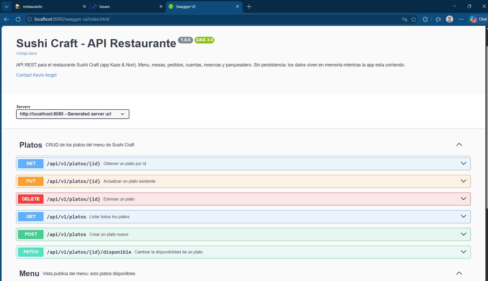
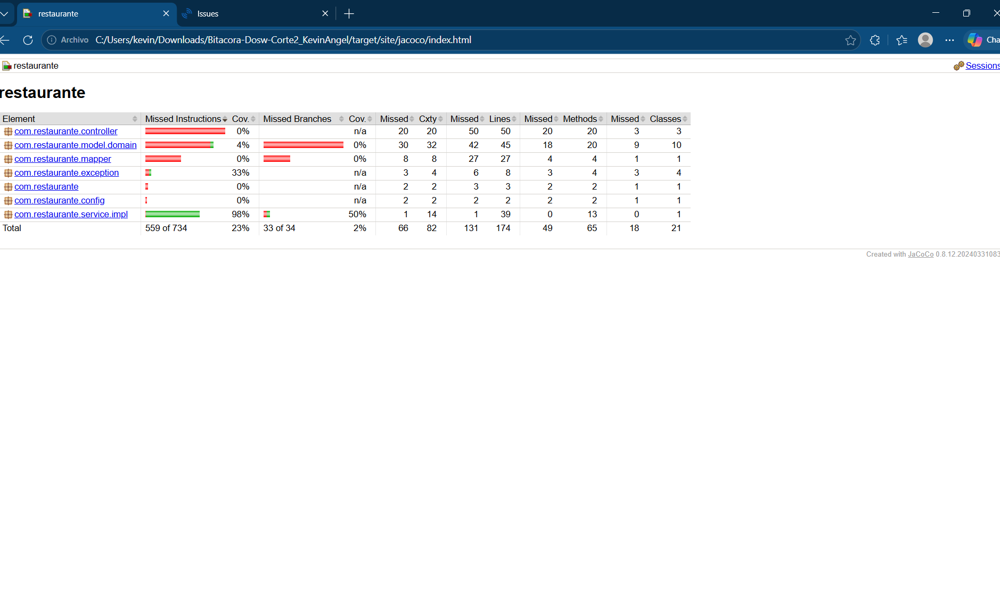
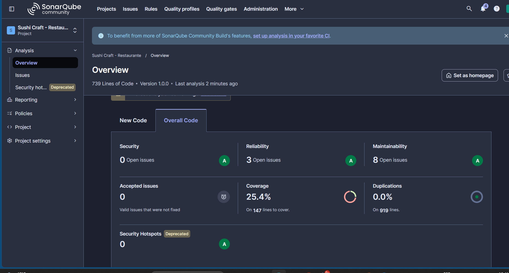
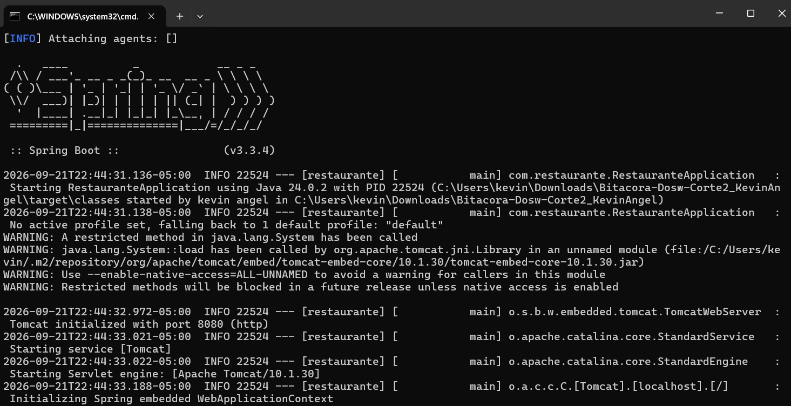

# Bitacora DOSW - Corte 2 - Sushi Craft

**Autor:** Kevin Angel _(ajusta tu nombre completo tal como debe aparecer en la entrega)_

## Descripcion

API REST del restaurante **Sushi Craft** (app *Kaze & Nori*), el concepto de
restaurante escogido en el LAB03 de corte 1. Construida siguiendo la Guia
Turtwig (arquitectura por capas: Dominio -> DTO -> Mapper -> Service ->
Controller) y las diapositivas de la Semana 8 de DOSW 1.

**Estado actual: sin persistencia.** Los Services guardan todo en memoria
(`Map`/`AtomicLong`) mientras no se agregue base de datos - asi lo pide
explicitamente la clase.

## Funcionalidades

La API agrupa las funcionalidades en dos vistas sobre el mismo dominio de
platos (ver diapositiva 24 del deck: Menu = lo que ve el cliente, Platos =
lo que administra el gerente):

- **Administracion de platos** (`/api/v1/platos`): CRUD completo para que
  el gerente cree, edite, consulte, active/desactive disponibilidad y
  elimine platos del menu.
- **Menu publico** (`/api/v1/menu`): vista de solo lectura para el
  cliente, que solo muestra los platos disponibles en este momento, con
  filtro opcional por categoria (Roll, Nigiri, Sashimi, Temaki, Entrada,
  Bebida).
- **Manejo de errores uniforme**: cualquier endpoint responde con el mismo
  formato de error (`ErrorResponseDTO`) ante recurso no encontrado,
  datos invalidos o body malformado.

## Tabla de endpoints

| Metodo | Ruta | Descripcion | Respuestas |
|---|---|---|---|
| GET | `/api/v1/platos` | Listar todos los platos (disponibles o no) | 200 |
| GET | `/api/v1/platos/{id}` | Obtener un plato por id | 200, 404 |
| POST | `/api/v1/platos` | Crear un plato nuevo (queda disponible por defecto) | 201, 400 |
| PUT | `/api/v1/platos/{id}` | Actualizar un plato existente | 200, 404, 400 |
| PATCH | `/api/v1/platos/{id}/disponible?disponible={true\|false}` | Cambiar la disponibilidad de un plato | 200, 404 |
| DELETE | `/api/v1/platos/{id}` | Eliminar un plato | 204, 404 |
| GET | `/api/v1/menu` | Ver el menu publico (solo platos disponibles) | 200 |
| GET | `/api/v1/menu/categoria/{categoria}` | Ver el menu filtrado por categoria | 200 |

## Como se ejecuta

```
mvn spring-boot:run
```
- API: http://localhost:8080/api/v1/...
- Swagger UI: http://localhost:8080/swagger-ui/index.html

## Pruebas y cobertura

```
mvn test
```
Corre las 11 pruebas unitarias de `PlatoServiceImplTest` y genera el
reporte de cobertura de Jacoco en `target/site/jacoco/index.html`
(abrelo en el navegador despues de correr `mvn test`).

## Analisis estatico (SonarQube local)

SonarQube corre localmente en Docker (contenedor `sonarqube`, puerto 9000).

1. En Docker Desktop, inicia el contenedor `sonarqube` (boton Play) y
   espera ~1 minuto a que levante.
2. Abre http://localhost:9000 (usuario/clave que ya tengas configurados).
3. Crea el proyecto (o usa uno existente) y copia su **Project Key**.
4. En **My Account > Security**, genera un **token**.
5. En `pom.xml`, reemplaza `sonar.projectKey` por la key del paso 3.
6. Corre:

```
mvn verify sonar:sonar -Dsonar.token=TU_TOKEN
```

(o exporta `SONAR_TOKEN` como variable de entorno en vez de pasarlo por
linea de comandos). El reporte queda visible en http://localhost:9000
dentro del proyecto.

## Evidencias

> Pega aqui las capturas de pantalla antes de entregar. Guardalas en una
> carpeta `docs/evidencias/` y enlazalas con ``.

### Swagger UI



### Cobertura de pruebas (Jacoco)



Cobertura total del proyecto: 23% (559/734 instrucciones). El paquete
`service.impl` (que es el que tiene pruebas unitarias, `PlatoServiceImpl`)
llega al 98% de cobertura de instrucciones.

### Analisis estatico (SonarQube local)



### Ejecucion



### Pruebas por funcionalidad (Postman)

_(capturas de Postman probando cada endpoint de la tabla de arriba: al
menos un caso exitoso y un caso de error por funcionalidad, por ejemplo
GET /api/v1/platos/9999 -> 404, POST /api/v1/platos con body vacio -> 400)_

## Avance (hasta diapositiva 87 del deck de la S08)

Dominio completo (7 clases + enums) segun el diagrama de clases del
restaurante. Capa completa (DTO/Mapper/Service/Controller) implementada
por ahora solo para **Plato** (con dos Controllers que lo exponen
distinto, ver diapositiva 24: Menu = lo que ve el cliente, Plato = lo
que administra el gerente - mismo Service).

- [x] `model/domain/` - las 7 clases de dominio + enums (`EstadoMesa`, `EstadoPedido`, `EstadoCuenta`)
- [x] `model/dto/request/PlatoRequestDTO.java` + `response/PlatoResponseDTO.java` - con Bean Validation
- [x] `mapper/PlatoMapper.java` - MapStruct (`@Mapper(componentModel="spring")`)
- [x] `service/IPlatoService.java` + `service/impl/PlatoServiceImpl.java` - en memoria, con Streams
- [x] `controller/PlatoController.java` (`/api/v1/platos`, CRUD completo - administracion)
- [x] `controller/MenuController.java` (`/api/v1/menu`, solo lectura - lo que ve el cliente)
- [x] Excepciones personalizadas: `RecursoNoEncontradoException`, `ConflictoException`, `EstadoInvalidoException`, `ReglaDeNegocioException`
- [x] `ErrorResponseDTO` + `GlobalExceptionHandler` (`@RestControllerAdvice`, respuestas uniformes, handlers mas especificos primero)
- [x] Swagger / OpenAPI (`springdoc-openapi`, `OpenApiConfig`, `@Operation`/`@ApiResponse` en los controllers)
- [x] `@Slf4j` y logs en controllers y service
- [x] Versionamiento de rutas (`/api/v1/...`)
- [x] Pruebas unitarias del Service con JUnit 5 (`PlatoServiceImplTest`, 11 casos: happy path, recurso no encontrado, lista vacia, filtros)
- [x] Diagrama de secuencia de "Crear un Plato" (happy path + error) - [`docs/diagramas/secuencia-crear-plato.md`](docs/diagramas/secuencia-crear-plato.md)
- [x] Jacoco (`jacoco-maven-plugin`, reporte con `mvn test` en `target/site/jacoco/index.html`)
- [x] Sonar (`sonar-maven-plugin` en `pom.xml`, analisis corrido contra SonarQube local: 0 issues de Security, 3 de Reliability, 8 de Maintainability, todos severidad baja, 0% duplicaciones)

## Pendiente

- [ ] Pegar las capturas de Postman (pruebas por funcionalidad) en `docs/evidencias/` y enlazarlas en este README
- [ ] Validaciones de negocio con `IPlatoValidator` (nombre unico, etc.) - opcional segun el deck
- [ ] `application.yml` con perfiles por ambiente (no es obligatorio: la config actual es simple)
- [ ] Pruebas del Controller con `@Mock`/`@InjectMocks` (mockeando `IPlatoService` y `PlatoMapper`)
- [ ] Resto de los dominios de Sushi Craft con capa completa: Mesa, Pedido, ItemPedido, Cuenta, Reserva, RegistroVehiculo (por ahora solo tienen el dominio)
- [ ] Diagrama de clases actualizado con los cambios de hoy

## Estructura
```
src/main/java/com/restaurante/
  RestauranteApplication.java
  config/OpenApiConfig.java
  model/domain/          Plato, Mesa, Pedido, ItemPedido, Cuenta, Reserva, RegistroVehiculo + enums
  model/dto/request/PlatoRequestDTO.java
  model/dto/response/PlatoResponseDTO.java
  model/dto/ErrorResponseDTO.java
  mapper/PlatoMapper.java
  service/IPlatoService.java
  service/impl/PlatoServiceImpl.java
  controller/PlatoController.java
  controller/MenuController.java
  controller/GlobalExceptionHandler.java
  exception/                RecursoNoEncontradoException, ConflictoException, EstadoInvalidoException, ReglaDeNegocioException
src/test/java/com/restaurante/
  service/impl/PlatoServiceImplTest.java
docs/diagramas/
  secuencia-crear-plato.md
docs/evidencias/
  (capturas de Swagger, Jacoco, Sonar, ejecucion y pruebas por funcionalidad)
```
