# Bitacora DOSW - Corte 2 - Sushi Craft

**Autor:** Kevin Angel

## Descripcion

API REST del restaurante **Sushi Craft** (app *Kaze & Nori*), el concepto de
restaurante escogido en el LAB03 de corte 1. Construida siguiendo la Guia
Turtwig (arquitectura por capas: Dominio -> DTO -> Mapper -> Service ->
Controller) y las diapositivas de la Semana 8 de DOSW 1.

Ademas del CRUD de platos, se implemento el CRUD completo de los otros 6
dominios del restaurante (Mesa, Pedido, ItemPedido, Cuenta, Reserva y
RegistroVehiculo), siguiendo la misma arquitectura por capas.

**Semana 9:** los 7 dominios ya no guardan en memoria, ahora persisten
en PostgreSQL con JPA/Hibernate. Los cambios de estado de un pedido
quedan ademas en un historial en MongoDB. Y la API quedo protegida:
hay que autenticarse con un token JWT para usarla, y crear, editar o
eliminar esta restringido por rol (GERENTE, MESERO, COCINERO).

## Funcionalidades

La API agrupa las funcionalidades en los 7 dominios del restaurante:

- **Platos** (`/api/v1/platos`): CRUD completo para que el gerente cree,
  edite, consulte, active/desactive disponibilidad y elimine platos del
  menu.
- **Menu publico** (`/api/v1/menu`): vista de solo lectura para el
  cliente, que solo muestra los platos disponibles en este momento, con
  filtro opcional por categoria (Roll, Nigiri, Sashimi, Temaki, Entrada,
  Bebida).
- **Mesas** (`/api/v1/mesas`): CRUD de las mesas del restaurante y cambio
  de estado (LIBRE, OCUPADA, RESERVADA).
- **Pedidos** (`/api/v1/pedidos`): CRUD de los pedidos de cada mesa, con
  cambio de estado (RECIBIDO, EN_PREPARACION, LISTO, ENTREGADO,
  CANCELADO) y calculo automatico del total a partir de sus items.
- **Items de pedido** (`/api/v1/items-pedido`): agregar/editar/eliminar
  items dentro de un pedido. El nombre y el precio del plato se "congelan"
  al momento de crear el item (no cambian si despues se edita el plato).
- **Cuentas** (`/api/v1/cuentas`): CRUD de las cuentas por mesa, con
  actualizacion del total y cierre de cuenta.
- **Reservas** (`/api/v1/reservas`): CRUD de las reservas de mesa, con
  cancelacion y reprogramacion.
- **Parqueadero** (`/api/v1/vehiculos`): registro de entrada y salida de
  vehiculos.
- **Autenticacion** (`/auth/login`): login con email y password que
  devuelve un token JWT. El resto de la API (menos el menu publico) pide
  ese token, y crear/editar/eliminar ademas pide un rol especifico.
- **Historial de pedido** (`/api/v1/pedidos/{id}/eventos`): cada pedido
  que se crea o cambia de estado queda registrado en MongoDB.
- **Manejo de errores uniforme**: cualquier endpoint responde con el mismo
  formato de error (`ErrorResponseDTO`) ante recurso no encontrado,
  datos invalidos o body malformado.

## Diagrama de clases

Dominio de Sushi Craft (7 clases + 3 enums) y sus relaciones:
- Archivo editable (abrir en [draw.io](https://app.diagrams.net) / diagrams.net): [`docs/diagramas/diagrama-clases-sushicraft.drawio`](docs/diagramas/diagrama-clases-sushicraft.drawio)
- Explicacion de las relaciones y respuesta a la diapositiva 9: [`docs/diagramas/diagrama-clases.md`](docs/diagramas/diagrama-clases.md)

## Tabla de endpoints

### Platos y menu

| Metodo | Ruta | Descripcion | Respuestas |
|---|---|---|---|
| GET | `/api/v1/platos` | Listar todos los platos (disponibles o no) | 200 |
| GET | `/api/v1/platos/{id}` | Obtener un plato por id | 200, 404 |
| POST | `/api/v1/platos` | Crear un plato nuevo (queda disponible por defecto) | 201, 400 |
| PUT | `/api/v1/platos/{id}` | Actualizar un plato existente | 200, 404, 400 |
| PATCH | `/api/v1/platos/{id}/disponible?disponible={true\|false}` | Cambiar la disponibilidad de un plato | 200, 404 |
| DELETE | `/api/v1/platos/{id}` | Eliminar un plato | 204, 404 |
| GET | `/api/v1/menu` | Ver el menu publico (solo platos disponibles) | 200 |
| GET | `/api/v1/menu/categoria/{categoria}` | Ver el menu filtrado por categoria | 200 |

### Mesas

| Metodo | Ruta | Descripcion | Respuestas |
|---|---|---|---|
| GET | `/api/v1/mesas` | Listar todas las mesas | 200 |
| GET | `/api/v1/mesas/{id}` | Obtener una mesa por id | 200, 404 |
| POST | `/api/v1/mesas` | Crear una mesa nueva (queda LIBRE por defecto) | 201, 400 |
| PUT | `/api/v1/mesas/{id}` | Actualizar una mesa existente | 200, 404, 400 |
| PATCH | `/api/v1/mesas/{id}/estado?estado={LIBRE\|OCUPADA\|RESERVADA}` | Cambiar el estado de una mesa | 200, 404 |
| DELETE | `/api/v1/mesas/{id}` | Eliminar una mesa | 204, 404 |

### Pedidos

| Metodo | Ruta | Descripcion | Respuestas |
|---|---|---|---|
| GET | `/api/v1/pedidos?idMesa=` | Listar todos los pedidos (o filtrar por mesa) | 200 |
| GET | `/api/v1/pedidos/{id}` | Obtener un pedido por id | 200, 404 |
| POST | `/api/v1/pedidos` | Crear un pedido nuevo (queda RECIBIDO y sin items) | 201, 400 |
| PUT | `/api/v1/pedidos/{id}` | Actualizar un pedido existente | 200, 404, 400 |
| PATCH | `/api/v1/pedidos/{id}/estado?estado=` | Cambiar el estado del pedido | 200, 404 |
| DELETE | `/api/v1/pedidos/{id}` | Eliminar un pedido | 204, 404 |

### Items de pedido

| Metodo | Ruta | Descripcion | Respuestas |
|---|---|---|---|
| GET | `/api/v1/items-pedido?idPedido=` | Listar todos los items (o filtrar por pedido) | 200 |
| GET | `/api/v1/items-pedido/{id}` | Obtener un item por id | 200, 404 |
| POST | `/api/v1/items-pedido` | Agregar un item a un pedido (congela nombre/precio del plato) | 201, 400, 404 |
| PATCH | `/api/v1/items-pedido/{id}/cantidad?cantidad=` | Cambiar la cantidad de un item | 200, 404 |
| DELETE | `/api/v1/items-pedido/{id}` | Eliminar un item | 204, 404 |

### Cuentas

| Metodo | Ruta | Descripcion | Respuestas |
|---|---|---|---|
| GET | `/api/v1/cuentas?idMesa=` | Listar todas las cuentas (o filtrar por mesa) | 200 |
| GET | `/api/v1/cuentas/{id}` | Obtener una cuenta por id | 200, 404 |
| POST | `/api/v1/cuentas` | Abrir una cuenta nueva (queda ABIERTA en 0) | 201, 400 |
| PATCH | `/api/v1/cuentas/{id}/total?total=` | Actualizar el total acumulado | 200, 404 |
| PATCH | `/api/v1/cuentas/{id}/cerrar` | Cerrar una cuenta | 200, 404 |
| DELETE | `/api/v1/cuentas/{id}` | Eliminar una cuenta | 204, 404 |

### Reservas

| Metodo | Ruta | Descripcion | Respuestas |
|---|---|---|---|
| GET | `/api/v1/reservas?idMesa=` | Listar todas las reservas (o filtrar por mesa) | 200 |
| GET | `/api/v1/reservas/{id}` | Obtener una reserva por id | 200, 404 |
| POST | `/api/v1/reservas` | Crear una reserva nueva | 201, 400 |
| PUT | `/api/v1/reservas/{id}` | Actualizar una reserva existente | 200, 404, 400 |
| PATCH | `/api/v1/reservas/{id}/cancelar` | Cancelar una reserva | 200, 404 |
| PATCH | `/api/v1/reservas/{id}/reprogramar?fechaHora=` | Reprogramar una reserva | 200, 404 |
| DELETE | `/api/v1/reservas/{id}` | Eliminar una reserva | 204, 404 |

### Parqueadero

| Metodo | Ruta | Descripcion | Respuestas |
|---|---|---|---|
| GET | `/api/v1/vehiculos?activos=` | Listar todos los registros (o solo los activos) | 200 |
| GET | `/api/v1/vehiculos/{id}` | Obtener un registro por id | 200, 404 |
| POST | `/api/v1/vehiculos` | Registrar el ingreso de un vehiculo | 201, 400 |
| PATCH | `/api/v1/vehiculos/{id}/salida` | Registrar la salida de un vehiculo | 200, 404 |
| DELETE | `/api/v1/vehiculos/{id}` | Eliminar un registro | 204, 404 |

### Autenticacion

| Metodo | Ruta | Descripcion | Respuestas |
|---|---|---|---|
| POST | `/auth/login` | Login con email y password, devuelve un token JWT valido por 24h | 200, 401 |

El token se manda en cada peticion protegida con el header
`Authorization: Bearer <token>`. Sin token (o con uno invalido) la API
responde 401. Con token pero sin el rol necesario, responde 403.

Los GET de los 7 dominios solo piden estar autenticado, sin importar el
rol. Crear, editar y cambiar estado esta permitido para GERENTE y
MESERO (el cambio de estado de un pedido tambien lo puede hacer
COCINERO). Eliminar esta reservado para GERENTE, salvo en items de
pedido donde tambien puede MESERO. El menu publico (`/api/v1/menu`) no
pide token, para que un cliente pueda verlo sin loguearse.

Usuarios de prueba (se crean solos al arrancar la app la primera vez,
con `DataSeeder`; password `sushicraft123` para los 4):

| Email | Rol |
|---|---|
| gerente@sushicraft.com | GERENTE |
| mesero@sushicraft.com | MESERO |
| cocinero@sushicraft.com | COCINERO |
| cliente@sushicraft.com | CLIENTE |

### Historial de un pedido (MongoDB)

| Metodo | Ruta | Descripcion | Respuestas |
|---|---|---|---|
| GET | `/api/v1/pedidos/{idPedido}/eventos` | Ver el historial de eventos de un pedido (creacion, cambios de estado) | 200 |

Cada vez que se crea un pedido o cambia de estado, se guarda un evento
en una coleccion de MongoDB (`eventos_pedido`), aparte de PostgreSQL. Es
el unico dato del proyecto que vive en Mongo; el resto sigue en
PostgreSQL.

## Como se ejecuta

1. Levanta PostgreSQL local con Docker (una sola vez; si ya existe el
   contenedor, solo hace falta arrancarlo desde Docker Desktop):

```
docker run --name sushicraft-db -e POSTGRES_USER=postgres -e POSTGRES_PASSWORD=postgres -e POSTGRES_DB=sushicraft -p 5432:5432 -d postgres:16
```

2. Levanta MongoDB local con Docker (tambien una sola vez):

```
docker run --name sushicraft-mongo -p 27017:27017 -d mongo:7
```

3. Corre la aplicacion (Hibernate crea las tablas solo, gracias a
   `spring.jpa.hibernate.ddl-auto=update`, y al arrancar se crean los 4
   usuarios de prueba si la tabla todavia esta vacia):

```
mvn spring-boot:run
```
- API: http://localhost:8080/api/v1/...
- Swagger UI: http://localhost:8080/swagger-ui/index.html

4. Para probar un endpoint protegido en Swagger: primero hacer POST
   `/auth/login` con uno de los usuarios de prueba, copiar el `token`
   de la respuesta, y pegarlo en el boton **Authorize** de Swagger
   (arriba a la derecha) como `Bearer <token>`.

## Pruebas y cobertura

```
mvn test
```
Los tests de los 7 `ServiceImpl` se reescribieron con Mockito: antes el
service guardaba todo en un Map en memoria y el test lo usaba
directamente, ahora el service depende del repositorio JPA (y en
Pedido/ItemPedido tambien de otros services), asi que hay que simular
esas dependencias. De paso se agregaron casos que antes no existian,
como crear un plato con un nombre repetido. Corre `mvn test` para ver
el numero final de pruebas y el reporte de cobertura de Jacoco en
`target/site/jacoco/index.html`.

## Analisis estatico (SonarQube local)

SonarQube corre localmente en Docker (contenedor `sonarqube`, puerto 9000).

1. En Docker Desktop, inicia el contenedor `sonarqube` (boton Play) y
   espera ~1 minuto a que levante.
2. Abre http://localhost:9000 (usuario/clave que ya tengas configurados).
3. Crea el proyecto (o usa uno existente) y copia su **Project Key**.
4. En **My Account > Security**, genera un **token**.
5. En `pom.xml`, reemplaza `sonar.projectKey` por la key del paso 3.
6. Corre:

```
mvn verify sonar:sonar -Dsonar.token=TU_TOKEN
```

(o exporta `SONAR_TOKEN` como variable de entorno en vez de pasarlo por
linea de comandos). El reporte queda visible en http://localhost:9000
dentro del proyecto.

## Evidencias


### Swagger UI

Los 8 grupos de endpoints (Platos, Menu, Mesas, Pedidos, Items de pedido, Cuentas, Reservas, Parqueadero):

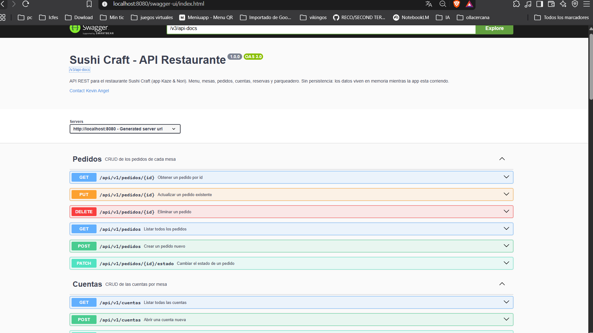

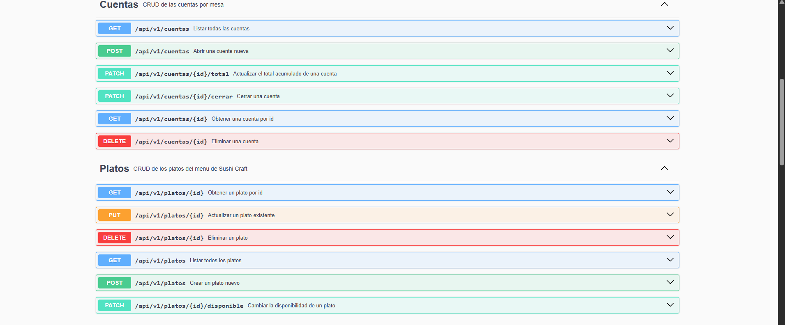

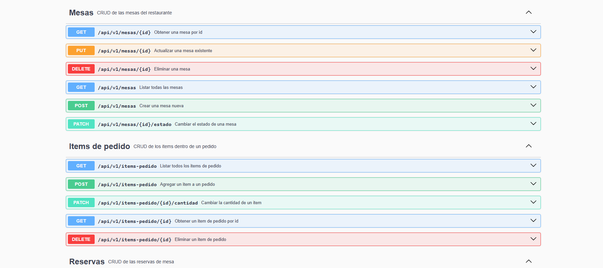

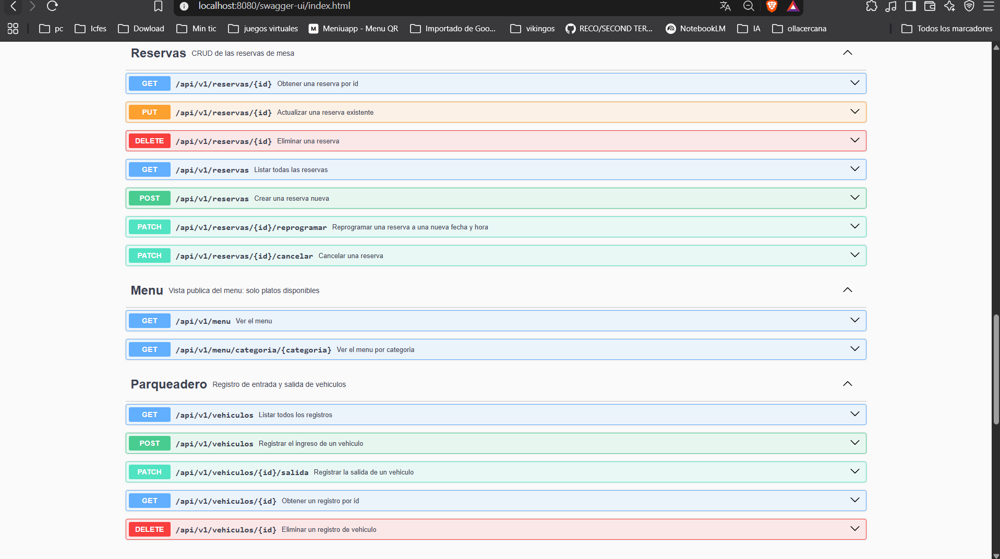

### Cobertura de pruebas (Jacoco)


Cobertura total: 66% de instrucciones y 50% de ramas. La mayor parte esta
en `service.impl` (99%) y `mapper` (93%), que es donde estan los 95 tests
unitarios. En `controller` y `config` queda en 0% porque solo se hicieron
pruebas unitarias, no de integracion con MockMvc.

### Analisis estatico (SonarQube local)

En el primer analisis el Quality Gate ya pasaba, pero salieron 37 issues:
3 de Reliability por usar `LocalDateTime.now()` sin zona horaria
(`GlobalExceptionHandler`, `RegistroVehiculo` y `Reserva`) y 34 de
Maintainability por usar `@ApiResponses({...})` como wrapper en los 7
controladores en vez de poner cada `@ApiResponse` por separado, que es
lo que pide la regla desde Java 8. Se corrigieron los dos y quedo en 0
issues.

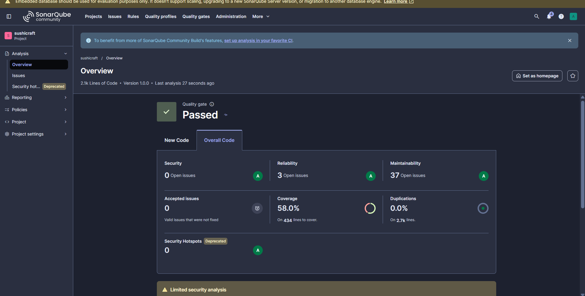

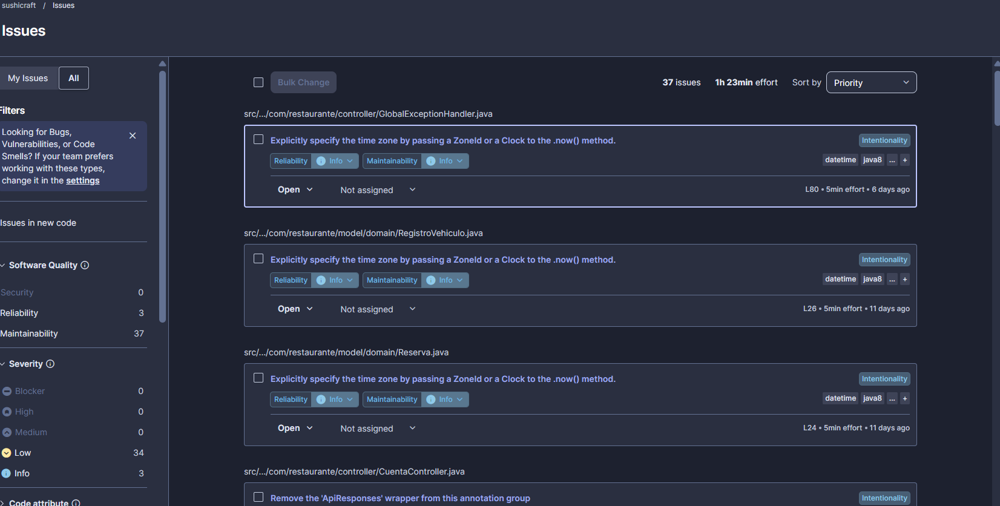


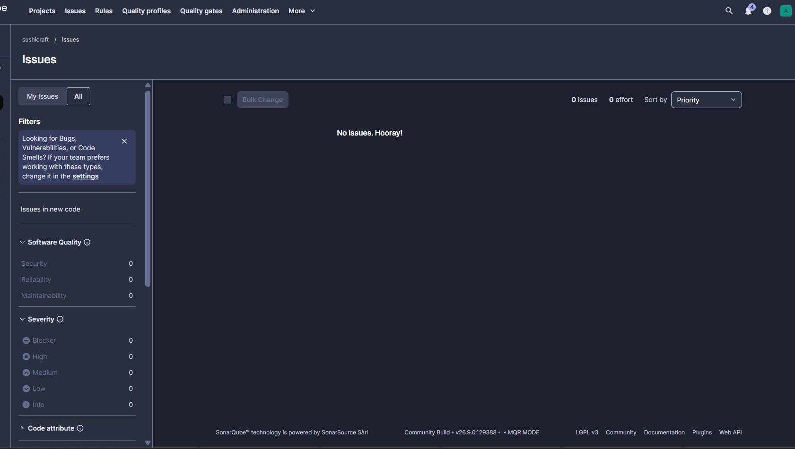

### Ejecucion


### Autenticacion, roles y persistencia (Semana 9)

Se corrio `mvn clean verify` y paso: compilo y los 97 tests (mapper +
service, estos ultimos reescritos con Mockito) quedaron en verde. Ya con
la app corriendo, con Postgres y Mongo en Docker, se probo lo siguiente
desde Swagger:

Login con el usuario de prueba `gerente@sushicraft.com` (devuelve el
token JWT):

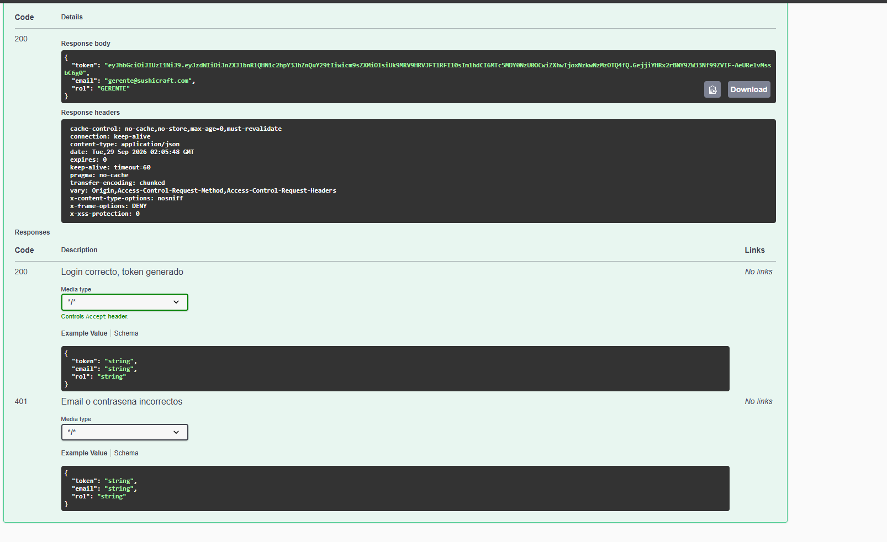

Con ese token puesto en el boton Authorize, crear un plato nuevo
funciona (201):

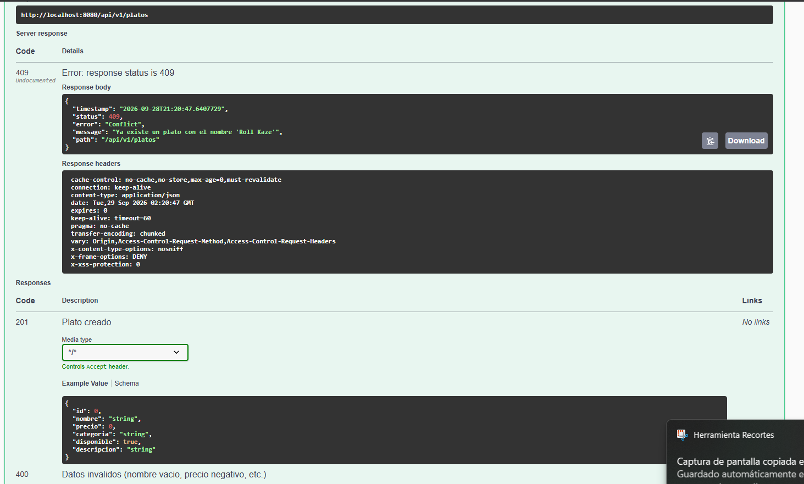

Sin token, el mismo tipo de endpoint responde 401 (se ve al abrir la
ruta directo en el navegador, sin loguearse):

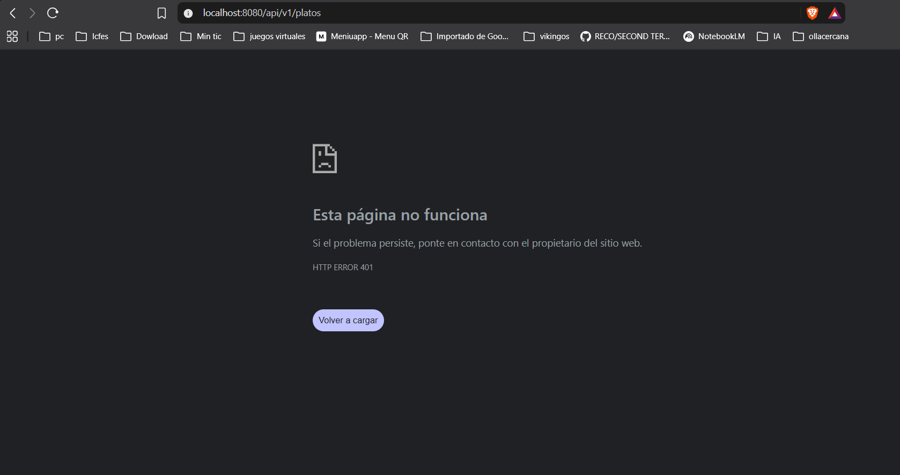

Con token pero con el usuario `cliente@sushicraft.com` (que no tiene
permiso para crear platos), responde 403:

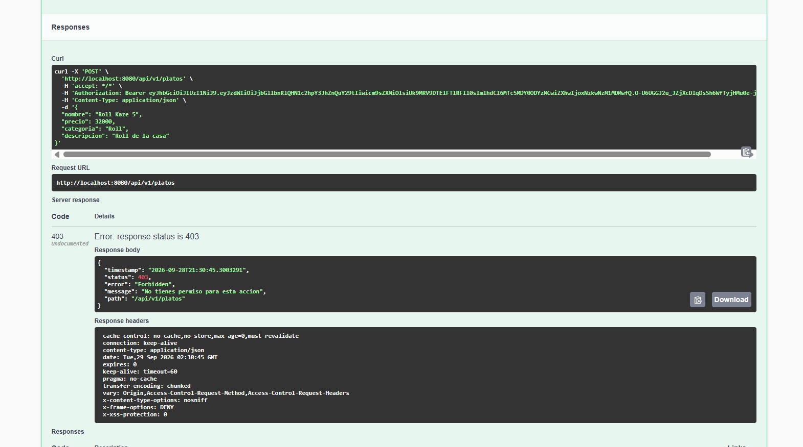

Cada vez que se crea un pedido o le cambian el estado, queda un evento
guardado en MongoDB. Esto es el `GET /api/v1/pedidos/{id}/eventos`
despues de crear un pedido y pasarlo a EN_PREPARACION:

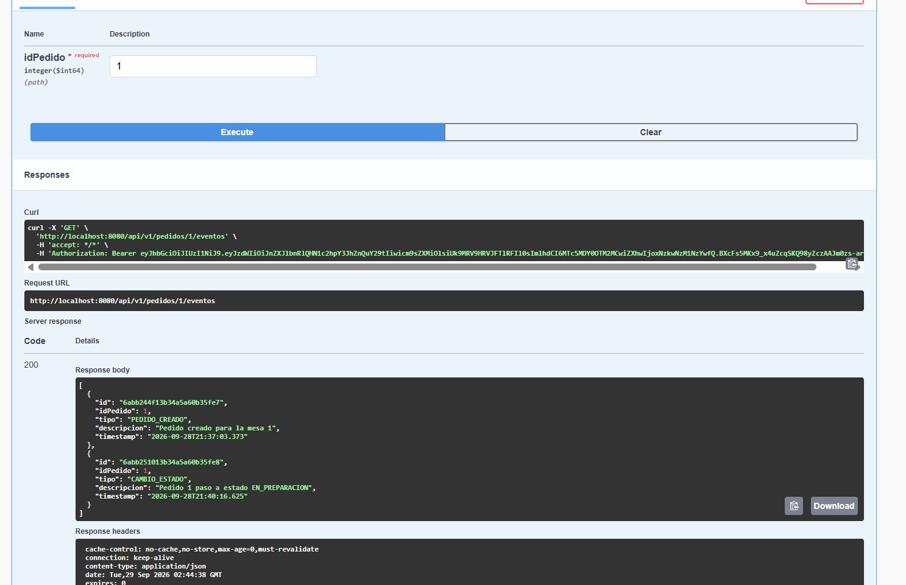

Y para confirmar que ya no se guarda en memoria: se pararon Postgres y
la app, se volvieron a prender, y los platos creados antes seguian ahi
(en la imagen, el plato `id=1` sigue con sus mismos datos despues del
reinicio):

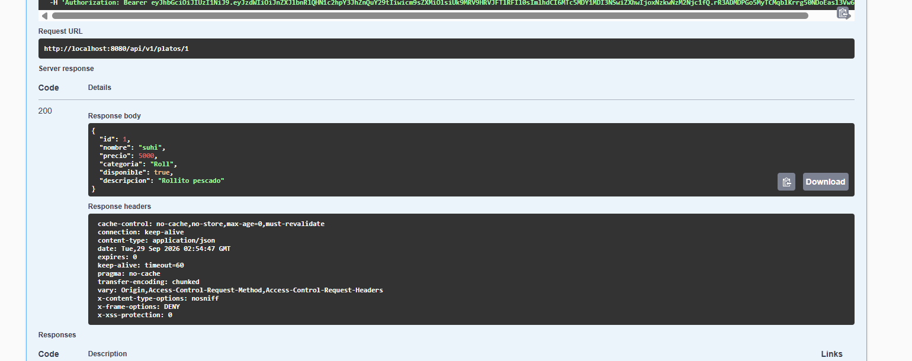

### Pruebas por funcionalidad (Postman)

Se probaron los 8 endpoints de platos y menu, cada uno con al menos un
caso exitoso y un caso de error:

| Endpoint | Caso exitoso | Caso de error |
|---|---|---|
| GET `/platos` | 200, lista completa | - |
| GET `/platos/{id}` | 200, plato encontrado | 404, id inexistente |
| POST `/platos` | 201, plato creado | 400, body invalido/vacio |
| PUT `/platos/{id}` | 200, plato actualizado | 404, id inexistente |
| PATCH `/platos/{id}/disponible` | 200, disponibilidad cambiada | 404, id inexistente |
| DELETE `/platos/{id}` | 204, plato eliminado | 404, id inexistente |
| GET `/menu` | 200, solo platos disponibles | - |
| GET `/menu/categoria/{categoria}` | 200, filtrado por categoria | - |

Capturas representativas (creacion, actualizacion, eliminacion y los
errores 404 al usar un id que ya no existe):


