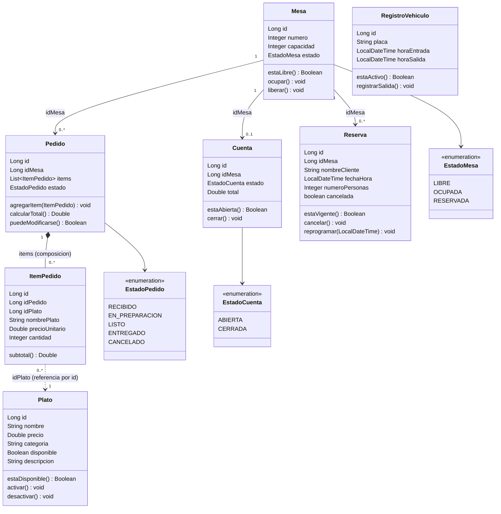

# Diagrama de clases - Sushi Craft (Kaze & Nori)

Diagrama de dominio tal como esta implementado en `model/domain/`, con las
relaciones entre clases y enums (respuesta a la diapositiva 9: "como serian
las relaciones para estas clases y Enums").

## Relaciones (explicacion)

- **Mesa 1 → 0..\* Pedido**: una mesa puede tener varios pedidos a lo largo
  del tiempo (relacion por `idMesa`, no por referencia directa a objeto -
  igual que en el resto del dominio, que esta en memoria sin persistencia).
- **Mesa 1 → 0..\* Reserva**: una mesa puede tener varias reservas.
- **Mesa 1 → 0..1 Cuenta**: una cuenta abierta corresponde a una mesa.
- **Pedido 1 \*-- 0..\* ItemPedido**: composicion, `Pedido` contiene su
  lista de `items` directamente (`List<ItemPedido>`); si se elimina el
  pedido, sus items dejan de existir.
- **ItemPedido → Plato**: cada item referencia un plato por `idPlato`, y
  copia `nombrePlato`/`precioUnitario` al momento de crear el pedido (asi
  el precio no cambia si el plato se actualiza despues - "precio
  congelado").
- **RegistroVehiculo** no tiene relacion con las demas clases en el
  modelo actual (es un dominio independiente de parqueadero).
- Los tres enums (`EstadoMesa`, `EstadoPedido`, `EstadoCuenta`) son
  atributos tipados de `Mesa`, `Pedido` y `Cuenta` respectivamente.

## Partes que faltaban en la guia de estudio (para la discusion en clase)

Comparando la guia contra lo que realmente se necesita para implementar
estas clases en Spring Boot, lo que no estaba explicito:

- Las **relaciones** entre clases (cardinalidad, y si son por referencia a
  id o por composicion de objeto) - no estaban dibujadas en el diagrama,
  solo los atributos y metodos de cada clase por separado.
- Que `ItemPedido` "congela" el precio del plato al momento del pedido
  (por eso tiene su propio `precioUnitario`/`nombrePlato` en vez de
  referenciar directamente a `Plato`).
- Que `RegistroVehiculo` es un dominio aparte, sin relacion con
  Mesa/Pedido/Cuenta.
