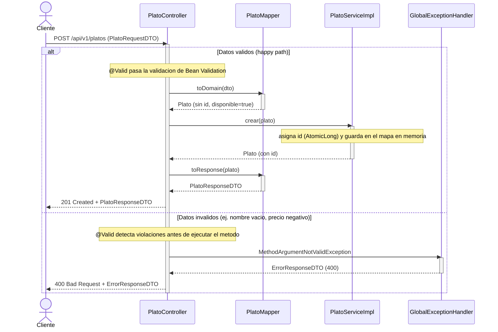

# Diagrama de secuencia - Crear un Plato

`POST /api/v1/platos`. Incluye el flujo exitoso (happy path) y el flujo de
error (validacion de input fallida), usando un fragmento `alt` para
mostrar ambos caminos en un solo diagrama.

